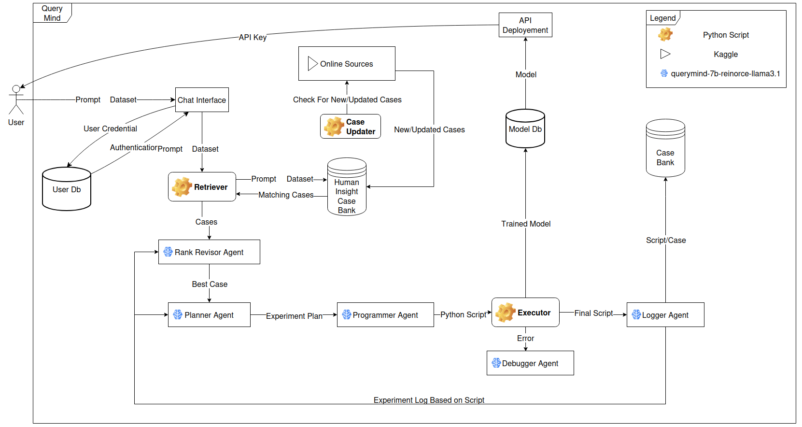

# QueryMind: Automated Data Science Platform

QueryMind is an automated data science platform that empowers users to solve complex machine learning tasks through case-based reasoning and large language models. Built upon the DS-Agent architecture ([ICML 2024 paper](https://arxiv.org/abs/2402.17453)), QueryMind extends the original system with enhanced functionality, a web interface, and improved model training capabilities.



## Features

- **Automated Machine Learning**: Automatically analyzes datasets, selects appropriate models, and optimizes hyperparameters
- **Multi-Agent Architecture**: Utilizes specialized agents (ranker, planner, programmer, debugger, logger) working together to solve data science tasks
- **Case-Based Reasoning**: Leverages a library of data science patterns and insights from real-world Kaggle competitions
- **Web Interface**: User-friendly interface powered by Llama 3.2 8B for natural language interaction
- **Model Training & Deployment**: Automatically trains models on custom datasets and provides the trained model for deployment
- **Multiple Data Modalities**: Supports tabular, text, and time series data analysis

## System Architecture

QueryMind consists of several key components:

1. **Web Frontend**: User-facing interface for uploading datasets and defining problems
2. **Backend API**: FastAPI service that handles requests, manages tasks, and returns results
3. **Model Server**: Dedicated server for the fine-tuned Qwen2.5-coder-7B model
4. **Agent Framework**: The core DS-Agent implementation with case-based reasoning capabilities
5. **Training Environment**: Executes and evaluates the generated machine learning code

## Setup

### Prerequisites

- Python 3.8+
- PyTorch 1.10+
- CUDA-compatible GPU (recommended)

### Installation

1. Clone the repository:
```bash
git clone https://github.com/AbdurRehmanAmin/QueryMind.git
cd QueryMind
```

2. Install the required packages:
```bash
pip install -r dev/requirements.txt
```

3. Set up the model server:
```bash
python model_server.py --load-at-startup --model-id "AbdurRehmanAmin/QueryMindCoder"
```

4. Start the backend API:
```bash
python backend_api.py
```

## Usage

### Using the Web Interface

1. Navigate to the web interface at `http://localhost:3000`
2. Upload your dataset
3. Describe your machine learning task in natural language
4. Set additional parameters (optional)
5. Submit the task and monitor progress

### Using the API Directly

```python
import requests

files = {'dataset': open('your_dataset.csv', 'rb')}
data = {
    'task_description': 'Predict housing prices based on features',
    'max_iterations': 3,
    'max_training_time': 1800
}

response = requests.post('http://localhost:8000/run-dsagent', files=files, data=data)
task_id = response.json()['task_id']

# Check status
status = requests.get(f'http://localhost:8000/task/{task_id}')
print(status.json())
```

## Extending QueryMind

### Adding New Case Types

To support new data modalities or machine learning tasks:

1. Add new cases to the case bank in `dev/Agents & Initializations/case_bank.py`
2. Follow the existing case format with problem description, solution approach, and insights
3. The system will automatically incorporate these cases into its reasoning process

### Customizing the Model

QueryMind uses a fine-tuned Qwen2.5-coder-7B model. To use a different model:

1. Modify `model_server.py` to use your preferred model
2. Update the `load_model` function with your model ID
3. Restart the model server

## License

This project is licensed under the MIT License - see the LICENSE file for details.

## Acknowledgments

- This project builds upon the [DS-Agent paper](https://arxiv.org/abs/2402.17453) by Guo et al.
- We acknowledge the MLAgentBench framework which provides the foundation for our implementation
